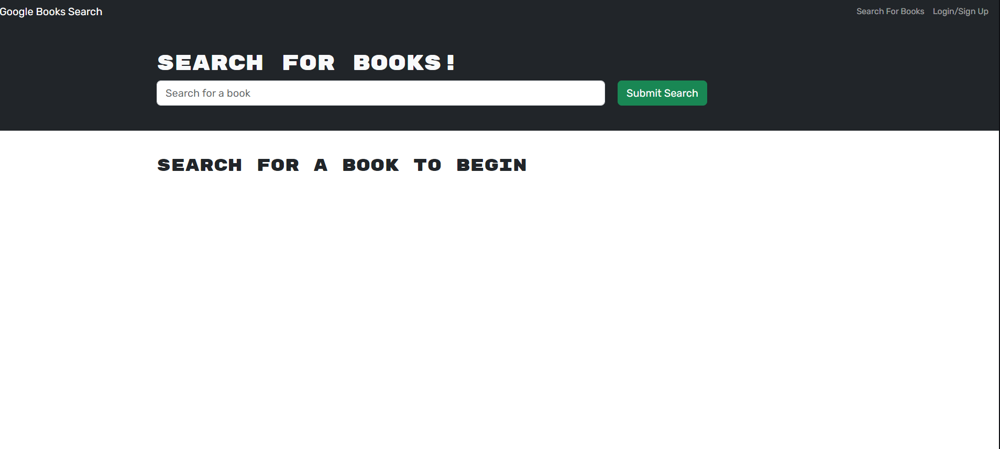
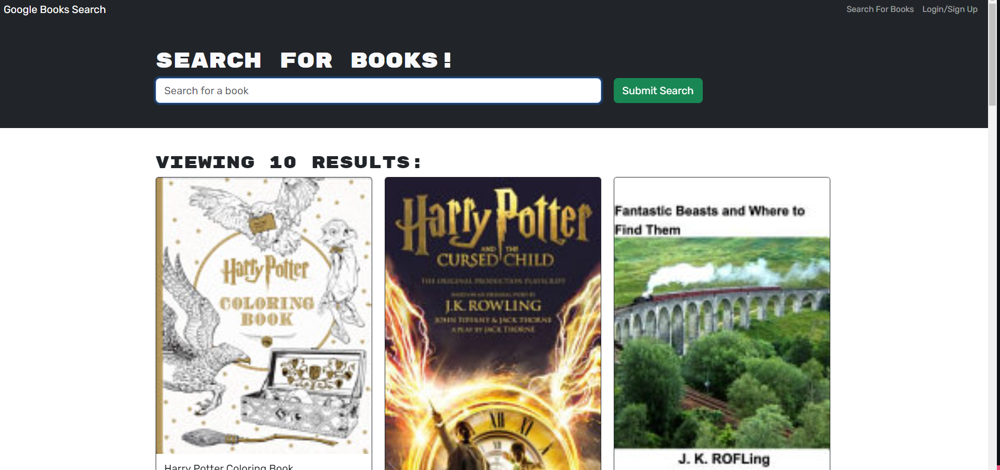

# book-search-engine
# Description 📈
```md
AS AN avid reader
I WANT to search for new books to read
SO THAT I can keep a list of books to purchase
```

# Acceptance Criteria 📝
```md
GIVEN a book search engine
WHEN I load the search engine
THEN I am presented with a menu with the options Search for Books and Login/Signup and an input field to search for books and a submit button
WHEN I click on the Search for Books menu option
THEN I am presented with an input field to search for books and a submit button
WHEN I am not logged in and enter a search term in the input field and click the submit button
THEN I am presented with several search results, each featuring a book’s title, author, description, image, and a link to that book on the Google Books site
WHEN I click on the Login/Signup menu option
THEN a modal appears on the screen with a toggle between the option to log in or sign up
WHEN the toggle is set to Signup
THEN I am presented with three inputs for a username, an email address, and a password, and a signup button
WHEN the toggle is set to Login
THEN I am presented with two inputs for an email address and a password and login button
WHEN I enter a valid email address and create a password and click on the signup button
THEN my user account is created and I am logged in to the site
WHEN I enter my account’s email address and password and click on the login button
THEN I the modal closes and I am logged in to the site
WHEN I am logged in to the site
THEN the menu options change to Search for Books, an option to see my saved books, and Logout
WHEN I am logged in and enter a search term in the input field and click the submit button
THEN I am presented with several search results, each featuring a book’s title, author, description, image, and a link to that book on the Google Books site and a button to save a book to my account
WHEN I click on the Save button on a book
THEN that book’s information is saved to my account
WHEN I click on the option to see my saved books
THEN I am presented with all of the books I have saved to my account, each featuring the book’s title, author, description, image, and a link to that book on the Google Books site and a button to remove a book from my account
WHEN I click on the Remove button on a book
THEN that book is deleted from my saved books list
WHEN I click on the Logout button
THEN I am logged out of the site and presented with a menu with the options Search for Books and Login/Signup and an input field to search for books and a submit button  
```
# Table of Contents 📓

- [book-search-engine](#book-search-engine)
- [Description 📈](#description-)
- [Acceptance Criteria 📝](#acceptance-criteria-)
- [Table of Contents 📓](#table-of-contents-)
- [Installation 💻](#installation-)
- [Usage 📎](#usage-)
- [License 📂](#license-)
- [Contributing 🔍](#contributing-)
- [Questions ❓📧❔](#questions-)

# Installation 💻

- npm i (to install all dependencies)
- npm start (to start the app)

# Usage 📎

Live Heroku Link: https://jheeebert-book-search-engine-96341c0d62be.herokuapp.com/

   <strong>Main Page</strong> <br>
    <br>
   <strong>Search</strong> <br>
    <br>
   <strong>Saved Books</strong> <br>
    <br>
   <strong>Delete Books</strong> <br>
    <br>
   <strong>Users</strong> <br>
    <br>

# License 📂
[](https://github.com/Naereen/StrapDown.js/blob/master/LICENSE)

# Contributing 🔍

[Contributors Covenant](https://www.contributor-covenant.org/) <br>

1. Fork the repository on GitHub.
2. Create a new branch with a descriptive name: `git checkout -b my-branch`
3. Make the necessary changes and commit them: ` git commit -m "Description of changes"`
4. Push your changes to your forked repository: `git push origin my-branch`
   <br>
   [](https://GitHub.com/Jheeebert/book-search-engine/commit/)
   [](https://GitHub.com/Jheeebert/book-search-engine/commit/)
   [](https://GitHub.com/Jheeebert/book-search-engine/network/)
   <br>
# Questions ❓📧❔

[](https://GitHub.com/Jheeebert/book-search-engine) <br>
* If you have any questions about the repo, open an issue @ link above or contact me directly at:  📧 wdfuzz8823@gmail.com 📧. <br>
* You can find more of my work at 🔖 [Jheeebert](https://github.com/Jheeebert/) 🔖. <br>
[](http://commonmark.org)